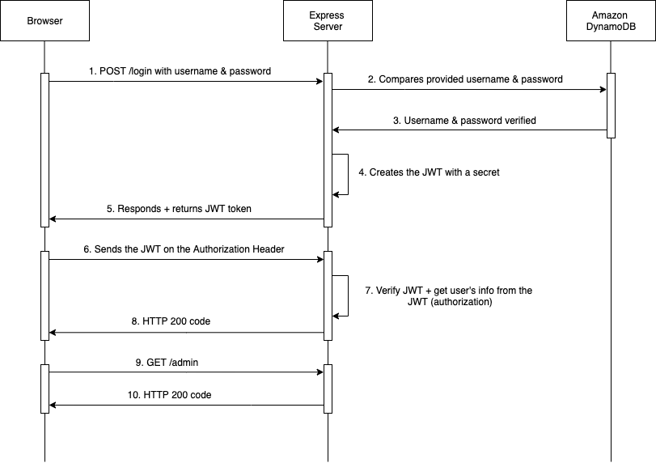

# Authentication
Authentication is utilized by `username` and `password` (credentials) provided by the user that is sent in a payload of the HTTP request. Client's credentials from HTTP request are verified with hashed credentials in the database.\
Since authentication throughout credentials is performed, the JWT access token is stored in Cookies in the client's browser, and used for every subsequent HTTP request (JWT access token does not need to be validated on every subsequent HTTP request - ***higher performance*** ).

Authentication flow is described in [Authentication & Authorization Flow](#authentication-&-authorization-flow).

# Authorization
Authorization is utilized by [JSON Web Token](https://jwt.io/introduction) (JWT).\
The advantage of JWT usage are:
- JWT is stored on the client's side
- the ease of client-side processing of JWTs on multiple platforms (web and mobile applications)

Authorization flow is described in [Authentication & Authorization Flow](#authentication-&-authorization-flow).

# Authentication & Authorization Flow
The diagram below describes how the user (admin) is authenticated, including authorization to access a protected server resource (***/admin***).\
JWT access token stored in Cookies allows the user to access the protected server resource without necessity to log in on every subsequent HTTP request. The user has to log in again when the JWT access token expires. The access token is also called the [***bearer token***](https://oauth.net/2/bearer-tokens/).

