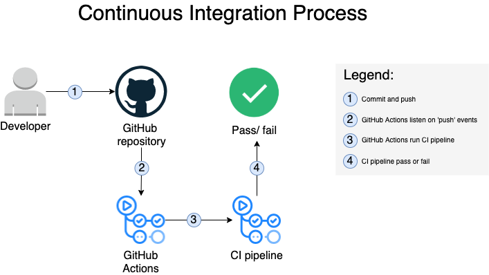

# Pipelines

## ci-pipeline
[Github Actions](https://docs.github.com/en/actions) are utilized to run CI pipeline. [`ci-pipeline`](../../.github/workflows/ci-pipeline.yml) runs two jobs:
1. creates a single instance of Ubuntu container, install pre-commit, clones the repository, install and run [pre-commit](https://pre-commit.com) hook scripts that are defined in [`.pre-commit-config.yaml`](../../.pre-commit-config.yaml  ) file.
1. creates a single instance of Ubuntu container, clones the repository and performs code quality and security scan by utilizing [SonarCloud](https://sonarcloud.io/).

Diagram below describes the process flow of trigerring [ci-pipeline](#ci-pipeline) powered by [Github Actions](https://docs.github.com/en/actions).

